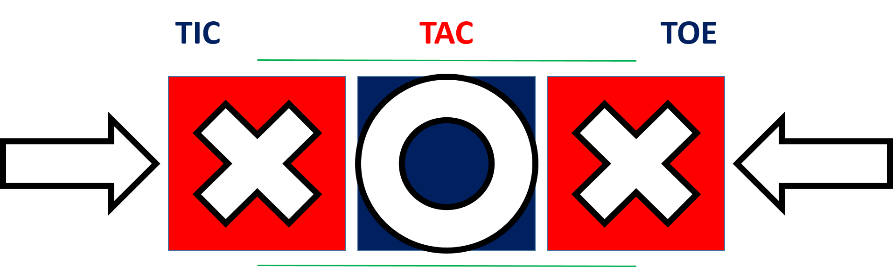
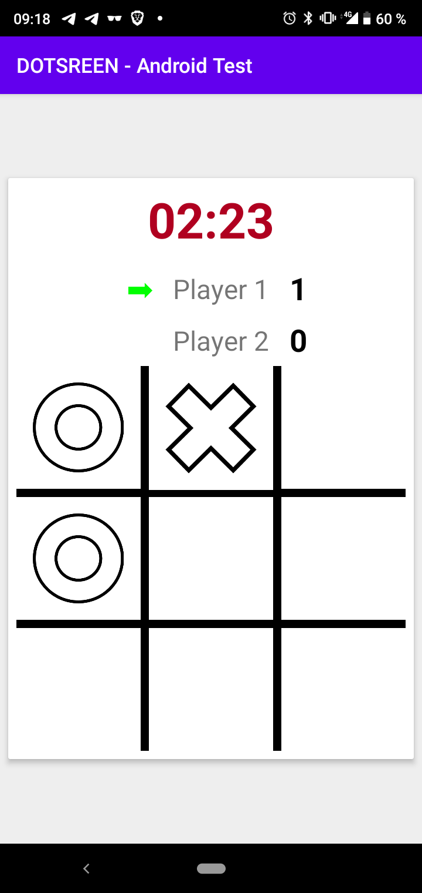
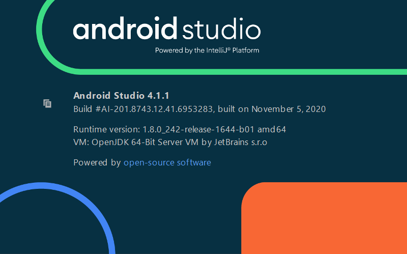

<!-- PROJECT SHIELDS -->
[![LinkedIn][linkedin-shield]][linkedin-url]

<!-- PROJECT LOGO -->
 

  <h3 align="center">Tic Tac Toe - Android</h3>
  

<!-- ABOUT THE PROJECT -->
## About The Project

This project was made as part of an Android Technical test.

The app is a timed Tic Tac Toes game between two human players using the same device.
Until time runs out they can play as many sets as they want. At the end a popup displays the overall game result.

(<a href="#top">back to top</a>)

<!-- SCREENSHOT -->
## Screenshot

    

 

(<a href="#top">back to top</a>)

### Built With

Only the standard Android SDK was used in this project.

* [Android](https://developer.android.com/docs)
* [Java](https://dev.java/)

(<a href="#top">back to top</a>)

<!-- Testing the app -->
## Testing the app

### Prerequisites

An android phone or tablet running at minimum Android 5.0 (API 21)

### Installation

<b>Option 1 :</b> get the APK from this github

 - Download the apk from <a href="https://github.com/alex-24/DOTSCREEN_Android_Test/tree/master/app/build/outputs/apk/debug"> here </a> (app-debug.apk)

 - Locate the apk file on your device and click on it to install. 

 - When prompted allow the installation from unknown sources.

 

2. Option 2 : Download the project and run it from your computer

 - Clone the project
 - Import it in Android Studio
 - Plug in an Android device that is already configured for development (or use an emulator)
 - Build and run the project.
 
 This is the Android Studio version I used :

 
    

(<a href="#top">back to top</a>)

<!-- MARKDOWN LINKS & IMAGES -->
[linkedin-shield]: https://img.shields.io/badge/-LinkedIn-black.svg?style=for-the-badge&logo=linkedin&colorB=555
[linkedin-url]: https://linkedin.com/in/alexis-cassion